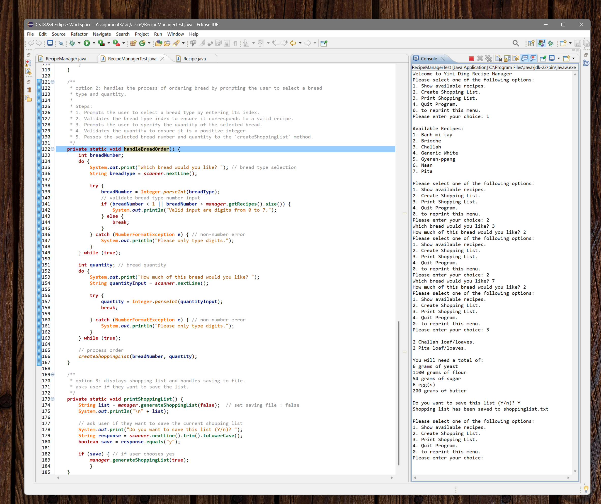

# Bread Recipe Manager

This is a Java-based recipe management system designed to help bakeries manage their bread recipes and generate shopping lists for ingredients. The program reads recipes from a file, allows users to place orders, and generates detailed shopping lists with exact quantities of ingredients needed.

## Features



- **Recipe Management**
  - Load recipes from text files
  - Display available recipes
  - Maintain ingredient quantities for each recipe

- **Order Processing**
  - Create orders for different types of bread
  - Input validation for quantities
  - Error handling for invalid inputs

- **Shopping List Generation**
  - Calculate total ingredients needed
  - Display shopping lists
  - Save shopping lists to file
  - Only show required ingredients (omit zero quantities)

## Project Structure

```
bread-recipe-manager/
├── src/
│   └── assn3/
│       ├── Recipe.java           # Recipe data class
│       ├── RecipeManager.java    # Recipe management and file operations
│       └── RecipeManagerTest.java # Main driver class
├── recipelist.txt               # Sample recipe file
└── README.md
```

## Classes

### Recipe
- Stores recipe data including name and ingredient quantities
- Contains getters and setters for all properties
- Tracks order quantity for each recipe

### RecipeManager
- Manages the collection of recipes
- Handles file I/O operations
- Provides methods for recipe access and order processing
- Generates shopping lists

### RecipeManagerTest
- Main driver class
- Handles user interaction
- Displays menus and processes user input
- Implements error handling

## File Format

The recipe file (`recipelist.txt`) must follow this format:
```
Recipe [Recipe Name]
flour [amount]
sugar [amount]
yeast [amount]
eggs [amount]
butter [amount]
```

Example:
```
Recipe Brioche
flour 250.0
yeast 3.0
sugar 16.0
eggs 4.0
butter 250.0
```

## Usage

1. **Compilation**
   ```bash
   javac assn3/*.java
   ```

2. **Running the Program**
   ```bash
   java assn3.RecipeManagerTest
   ```

3. **Menu Options**
   ```
   1. Show available recipes.
   2. Create Shopping List.
   3. Print Shopping List.
   4. Quit Program.
   0. to reprint this menu.
   ```

## Sample Output

```
Welcome to Recipe Manager

Please select one of the following options:
1. Show available recipes.
2. Create Shopping List.
3. Print Shopping List.
4. Quit Program.
0. to reprint this menu.
Please enter your choice: 1

Available Recipes:
1. Banh mi tay
2. Brioche
3. Challah
4. Generic White
5. Gyeren-ppang
6. Naan
7. Pita
```

## Error Handling

The program includes robust error handling for:
- File not found
- Invalid input formats
- Out of range values
- Negative quantities
- Non-numeric inputs

## Requirements

- Java Development Kit (JDK) 8 or higher
- Text file with recipes following the specified format

## Limitations

- Fixed recipe format
- Text-based user interface
- Single unit of measurement (grams)

## Future Improvements

- Add support for different units of measurement
- Implement GUI interface
- Add recipe modification capabilities
- Include recipe instructions
- Add database support

## Contributing

1. Fork the repository
2. Create a feature branch
3. Commit your changes
4. Push to the branch
5. Create a Pull Request

## Author

Yimi Ding


## Acknowledgments

- Created as part of the Object-Oriented Programming course at Algonquin College

